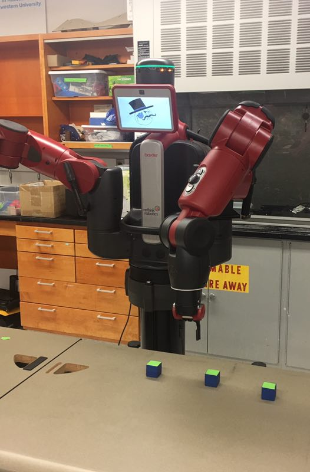

# ME 495 baxter_shuffle


# Baxter Shuffle
#### ME 495: Embedded Systems in Robotics
#### _Li-Chun Lu_
#### _Weiyuan Deng_
#### _Daniel Lynch_
#### _Dorian Kusznir_




### Introduction

This project uses Baxter to perform a simplified version of the classic [shell game](https://en.wikipedia.org/wiki/Shell_game). The original idea was that an object would be placed under one cup and Baxter would shuffle the three cups for some period of time. One of the audience could then guess which cup contains the object by placing their hand in front of the cup, and in response Baxter would grasp the cup and lift it to (maybe) reveal the object then place the cup back down on the table. We simplified that version of the shell game in two ways: 
  * instead of using cups and an object hidden inside one of the cups, this version uses three cubes, one of which has a marker on the underside; 
  * also, instead of shuffling the blocks randomly, Baxter moves each block to a position chosen randomly from a set of specified positions. The Shuffle Algorithm and Further Improvements sections below explain this simplification in greater detail.

Here is a [link](https://youtu.be/u8qGcpOJxrs) to a demonstration video we recorded.

### Equipment and Hardware Requirements

1. Baxter Robot

2. [ROS Indigo](http://wiki.ros.org/ROS/Installation) on Ubuntu 14.04

3. Three colored cubes

4. Marker

5. Table

6. Tape

### Preliminary Steps

To setup Baxter and workstation, please follow the [Baxter setup tutorial](http://sdk.rethinkrobotics.com/wiki/Baxter_Setup) from Rethink Robotics.

### Project Overview

1. Move the gripper to home position

2. Sweep the table to detect the cubes

3. Store the position of the three cubes

4. Move the gripper to the first cube 

5. Pick up the cube

6. Move the gripper to a random position

7. Place the cube on the table

8. Store the new location of the cube

9. Repeat step 4~8 to the rest two cubes

10. Move the gripper to a random cube

11. Pick up the cube

12. Move the gripper back to one of the original position

13. Place the cube on the table

14. Repeat step 10~13 to the rest two cubes


### Implementation

##### Shuffle Algorithm
  The shuffle algorithm went through several revisions before the group settled on the following algorithm:
  ```
  0. The three blocks start from known "home" positions.
  For each block:
    1. New position for current block is chosen randomly from an array of known positions in workspace
    2. Baxter moves the current block from its home position to the new position
  Steps 1 and 2 can be repeated for an arbitrary number of shufflings. 
  (Currently only 1 iteration is implemented.)

  Once shuffling is complete, Baxter will move the blocks back to the home positions 
  in a different order than their original order, finishing the shuffling sequence.
  ```
  The shuffling algorithm uses two arrays: one array consists of the target positions used during shuffling, and the other array is a 3x2 array of the current position of each block which is updated after each iteration of shuffling.

  See the Further Improvements section below for information about the flaws in this method.

  The first version of the shuffling algorithm entailed moving blocks between 3 known locations (for example, blocks A, B, and C would start in a row ABC and finish in a row BAC). This resulted in 30 different movements, and although 15 of these movements are just the other 15 in reverse order, this method was still too complex to quickly implement.

  The second version entailed randomly generating locations to move the blocks to, and is described more in the Further Improvements section below.

##### Scripts

`object_detection.py`
    
  Node name: 'left_hand_camera_detection'
  
  Function:
		
    This node converts the pixel-coordinate representation of the center of the detected cube to coordinates in Baxter's workspace. In the callback function for this node, we set the camera resolution to 640x400. When the program starts, the robot moves to a pre-defined home position. In Baxter's workspace, the camera identifies the cube by its green face, marks the perimeter of the cube and generates camera-frame coordinates of the cube's center point. 
			
    Note: we tried: `PinholeCameraModel()`, `image_geometry.PinholeCameraModel.projectPixelTo3dRay`, but they didn't work because although Baxter would move towards the specified target location, the final location of the end-effector was always off some distance from the target location.
			
    Note: in a second method, we followed the example [Worked_ExampleVisualServoing](http://sdk.rethinkrobotics.com/wiki/Worked_Example_Visual_Servoing), implementing the [image pixel to Workspace coordinate conversion](http://sdk.rethinkrobotics.com/wiki/Worked_Example_Visual_Servoing#Image_pixel_to_Workspace_coordinate_conversion). This method worked some of the time but resulted in unreliable pick-and-place performance, especially because of difficulty tuning the camera calibration factor `cc`.
	
  Subscribes to:
    /cameras/left_hand_camera/image
	
  Publishes to:
    'convertPixeltoCoordinate'
    This will publish the center point of the detected cube using the OpenCV image processor.

`tracking.py`
	
  Node name: limbs_tracking
	
  Function:
		
    This node receives the Baxter-frame coordinates of a point from the `left_hand_camera_detection` node. It uses the x-y coordinates of this point, along with a fixed z-coordinate and orientation (represented as a quaternion).
    Within this node there is a Python function named `control_baxter_arm()` that solves the inverse kinematics problem and moves Baxter's arm accordingly.
    First, moves to home position.
    Once at home position, uses `convertPixeltoCoordinate` and moves Baxter's left arm to the green cube described by this point.
		
    `getPoint()`
       Goes to home position, receives the target position. Set global flag to make sure arm receives target position before moving. Once the arm is at its target position, the flag is reset. This functions like an interrupt service routine (ISR). Once at the target position, the function saves the position into an array that keeps track of the blocks' locations.
	
  Subscribes to:
		
    '/convertPixeltoCoordinate'
    '/robot/limb/left/endpoint_state'
	
  Publishes to:
		
    (none)

### Further Improvements

The entire shuffling routine is currently not sufficiently robust. Improvements to the motion planning, computer vision, and shuffling algorithm would all increase robustness.

  1. Implement the inverse kinematics and motion planning for the limb motion. We control the limb simply providing a position in space and hope the IK service will give us a soution. However, we found the solution is not guarantee to find even we use random noise and current limb joint pose as seeds. The entire limb motion could be better if we can calculate severl waypoints along the initial pose and the final pose to reduce IK service error.

  2. Use a different method for detecting objects on the table. For example, we could have the end gripper and camera travel  above the workspace, inspect the entire area and mark the location where it sees objects and mark these locations for future use. In this approach, we may reduce the coordinate conversion error from using camera pixel coordinates or the vector from camera to the center of object. 

  3. Generate random points within Baxter's workspace. We originally implemented this method, but due to our motion planning method, we frequently encountered inverse kinematics errors (unreachable end-effector poses). Having a better definition of Baxter's reachable workspace and/or a more robust motion-planning algorithm would reduce the frequency of these errors. While our current method works, it is not as interesting as randomly-generated positions. Implementing such an improvement would also require specifying a tolerance for the distance between blocks and checking these distances either using forward kinematics or computer vision to ensure two blocks' positions don't overlap.

### Conclusion

Although challenging, working with Baxter was an extremely valuable experience. Our project is a simple implementation of a task that can easily be scaled to a difficult problem combining task planning, motion planning, and computer vision.


### Miscellaneous links:

Matlab version of shuffle algorithm [*Baxtershuffle.m*](https://github.com/dkusznir/baxter_shuffle/blob/master/src/Baxtershuffle.m)

shuffle algorithm python [*Baxtershuffle.py*](https://github.com/dkusznir/baxter_shuffle/blob/master/src/Baxtershuffle.py)

controller node, but not used in the program [*controller.py*](https://github.com/dkusznir/baxter_shuffle/blob/master/src/controller.py)

we use this node to try debug and test Baxter left arm movement [*move_limb.py*](https://github.com/dkusznir/baxter_shuffle/blob/master/src/move_limb.py)

node is modified to convert pixel image coordinate to baxter workspac… [*object_detection.py*](https://github.com/dkusznir/baxter_shuffle/blob/master/src/object_detection.py)

added pseudocode definition of random function [*rnd_loc_gen_notes.txt*](https://github.com/dkusznir/baxter_shuffle/blob/master/src/rnd_loc_gen_notes.txt)

[*tracking.py*](https://github.com/dkusznir/baxter_shuffle/blob/master/src/tracking.py)


example


